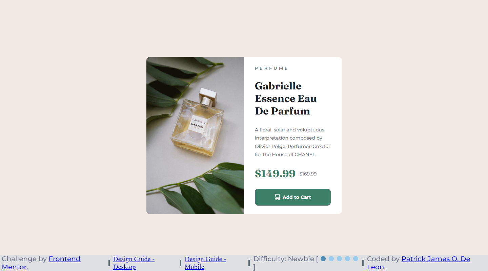

# Frontend Mentor - Product preview card component

This is a solution to the [Product preview card component challenge on Frontend Mentor](https://www.frontendmentor.io/challenges/product-preview-card-component-GO7UmttRfa). Frontend Mentor challenges help you improve your coding skills by building realistic projects.

## Table of contents

- [Overview](#overview)
  - [Screenshot](#screenshot)
  - [Links](#links)
- [My process](#my-process)
  - [Built with](#built-with)
  - [What I learned](#what-i-learned)
- [Author](#author)

## Overview

### Screenshot

### Links

- Solution URL: [Github](https://github.com/EcePJD/frontendMentor_productPreviewComponent)
- Live Site URL: [Github.io](https://ecepjd.github.io/frontendMentor_productPreviewComponent/)

## My process
Implementation of FlexBox CSS

### Built with
- Semantic HTML5 markup
- CSS custom properties
- Mobile-first workflow

### What I learned
Not what I learned but it helped me review and practice what I know about FlexBox CSS

## Author

- Github - [@EcePJD](https://github.com/EcePJD)
- Frontend Mentor - [@EcePJD](https://www.frontendmentor.io/profile/EcePJD)
- Facebook - [@ECEPJDeLeon](https://www.facebook.com/ECEPJDeLeon)